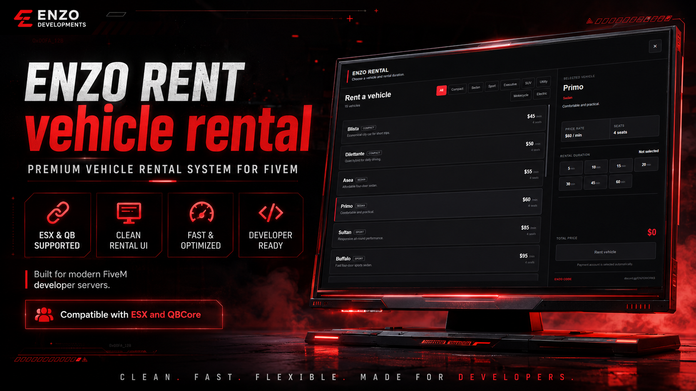

```text
███████╗███╗   ██╗███████╗ ██████╗      ██████╗ ██████╗ ██████╗ ███████╗
██╔════╝████╗  ██║╚══███╔╝██╔═══██╗    ██╔════╝██╔═══██╗██╔══██╗██╔════╝
█████╗  ██╔██╗ ██║  ███╔╝ ██║   ██║    ██║     ██║   ██║██║  ██║█████╗
██╔══╝  ██║╚██╗██║ ███╔╝  ██║   ██║    ██║     ██║   ██║██║  ██║██╔══╝
███████╗██║ ╚████║███████╗╚██████╔╝    ╚██████╗╚██████╔╝██████╔╝███████╗
╚══════╝╚═╝  ╚═══╝╚══════╝ ╚═════╝      ╚═════╝ ╚═════╝ ╚═════╝ ╚══════╝

               DISCORD • https://discord.gg/HPEAWNB52w
```

# ENZO CODE - Vehicle Rental 4.1.1

**Creator: ENZO CODE**

A configurable FiveM vehicle rental resource with a red/black NUI and native support for ESX and QBCore.

## Framework support

Set this in `config.lua`:

```lua
Config.Framework = 'auto' -- auto | esx | qb | custom
```

- `auto`: detects `es_extended` or `qb-core` using `Config.FrameworkPriority`.
- `esx`: forces ESX.
- `qb`: forces QBCore.
- `custom`: uses the functions inside `Config.CustomFramework`.

There is no hard dependency in `fxmanifest.lua`, so the resource can load on either ESX or QBCore.

## Installation

1. Put the resource folder in your FiveM resources directory.
2. Start your framework before this resource.
3. Add the resource to `server.cfg`:

```cfg
ensure EN-Rental
```

> Resource folder name must stay exactly `EN-Rental`. The server-side name lock stops the resource if the folder is renamed.

Do not rename the resource folder. The required resource name is `EN-Rental`.

## Vehicle key system

The key bridge is configured in `Config.VehicleKeys`.

```lua
Config.VehicleKeys = {
    System = 'auto', -- auto | none | qb-vehiclekeys | custom
    GiveOnSpawn = true,
    RemoveOnExpire = true,
    -- ...
}
```

### QBCore vehicle keys

For a normal QBCore setup using `qb-vehiclekeys`:

```lua
Config.VehicleKeys.System = 'qb-vehiclekeys'
```

Or leave it on `auto`; it checks whether the configured preset resource is started.

### Custom key resource

Use `custom` if your server uses another key script. You can call a client event, server event, or export from config without editing `client.lua`.

```lua
Config.VehicleKeys.System = 'custom'

Config.VehicleKeys.Custom = {
    Resource = 'mykeys',
    Give = {
        { Type = 'client_event', Name = 'mykeys:client:give', Args = { 'plate', 'netId' } },
        -- { Type = 'server_event', Name = 'mykeys:server:give', Args = { 'plate', 'netId' } },
        -- { Type = 'export', Resource = 'mykeys', Name = 'GiveKeys', Args = { 'entity', 'plate' } },
    },
    Remove = {
        { Type = 'client_event', Name = 'mykeys:client:remove', Args = { 'plate', 'netId' } },
    }
}
```

Available action arguments:

- `plate`
- `netId`
- `entity`
- `model`
- `fuel`
- `source`

If your key script does not need a remove event, leave `Remove = {}`.

## Payment

Payment accounts and their priority are configurable:

```lua
Config.Payment.Accounts = { 'cash', 'bank' }
```

The server calculates the price itself from `Config.Vehicles`; it does not trust the price sent by NUI/client. If the vehicle fails to spawn, the resource refunds the same account that was charged.

## Rental settings

Main behavior is inside `Config.Rental`:

```lua
Config.Rental = {
    Times = { 5, 10, 15, 20, 30, 45, 60 },
    DefaultPricePerMinute = 60,
    OneVehiclePerPlayer = false,
    SpawnClearRadius = 3.0,
    PendingTimeoutMs = 30000,
    ValidatePlayerDistance = true,
    ServerValidationDistance = 12.0,
    DeleteExpiredVehicle = false,
    DisableExpiredVehicle = true,
    DeleteOnResourceStop = true,
    WarpIntoVehicle = true,
    PlatePrefix = 'ENZO',
    PlateDigits = 4
}
```

## Edit rental vehicles

Every rental vehicle is controlled from `Config.Vehicles`.

```lua
{
    label = 'Sultan',
    model = 'sultan',
    price = 85,                 -- price per minute
    category = 'Sport',
    seats = 4,
    description = 'Responsive all-round performance.',
    image = '',                 -- optional local/remote image path
    fuel = 100.0,

    -- Optional GTA vehicle properties:
    primaryColor = 27,
    secondaryColor = 0,
    pearlescentColor = 0,
    wheelColor = 0,
    livery = 0,
    extras = {
        [1] = true,
        [2] = false
    },
    engineHealth = 1000.0,
    bodyHealth = 1000.0,
    dirtLevel = 0.0,
    windowTint = 0,
    warpIntoVehicle = true
}
```

You can add or remove as many entries as needed. Categories are generated automatically in the NUI.

## Fuel

Native GTA fuel is enabled by default:

```lua
Config.Fuel.System = 'native'
Config.Fuel.DefaultLevel = 100.0
```

For another fuel script, switch to `custom` and configure an event/export action using the same bridge format as vehicle keys.

## Interaction

The interaction key and distances are configurable:

```lua
Config.Interaction = {
    Distance = 2.2,
    DrawDistance = 18.0,
    Control = 38,
    KeyLabel = 'E',
    HideWhenInVehicle = true
}
```

If you change the control/key, also update `Config.Text.interact` so the displayed sentence matches.

## UI / red-black theme

Branding and all main colors are in `Config.UI`:

```lua
Config.UI.Brand = 'ENZO RENTAL'
Config.UI.BrandShort = 'ER'
Config.UI.Credit = 'ENZO CODE'
Config.UI.Discord = 'https://discord.gg/HPEAWNB52w'
Config.UI.Currency = '$'
```

The interface uses a compact list layout, flat dark surfaces, simple borders, and a red accent. It avoids oversized vehicle cards, decorative status widgets, gradients, and sci-fi styling.

## Locations

Add or edit rental desks inside `Config.Locations`:

```lua
{
    ped = vector4(215.760, -810.120, 30.730, 157.000),
    spawn = vector4(222.110, -804.450, 30.690, 339.000),
    pedModel = 'a_f_y_bevhills_02',
    blip = true
}
```

## Security / validation improvements

- Rental price is calculated server-side.
- Vehicle model, duration, and location are validated server-side.
- Optional server-side distance validation is included.
- Pending rentals use tokens and timeout/refund protection.
- Active rentals are tracked per token instead of a simple boolean.
- `OneVehiclePerPlayer` works across active rental tokens.
- Spawn failure automatically refunds the charged account.

---

**ENZO CODE**
